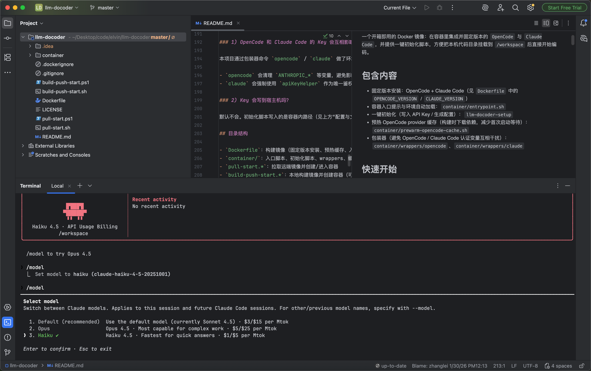
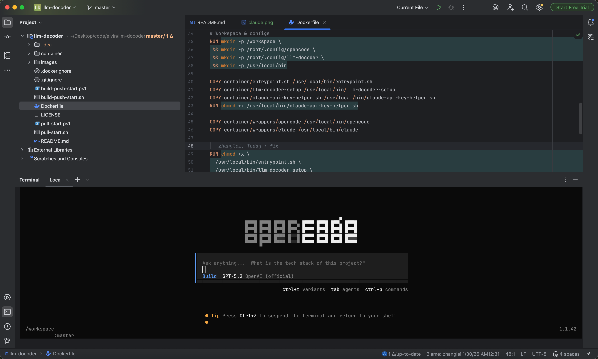

# llm-docoder

一个开箱即用的 Docker 镜像：在容器里集成并固定版本的 `OpenCode` 与 `Claude Code`，配套一键初始化脚本与 wrapper 做鉴权隔离；把本机代码目录挂载到 `/workspace` 后即可直接开始编码。

## 包含内容

- 固定版本安装：OpenCode + Claude Code（见 `Dockerfile` 中的 `OPENCODE_VERSION` / `CLAUDE_VERSION`）
- 容器入口提示与环境自动加载（自动 `source /root/.config/llm-docoder/env.sh`）：`container/entrypoint.sh`
- 一键初始化（写入 env.sh / 生成 OpenCode 与 Claude Code 配置）：`llm-docoder-setup`
- Claude Code 的 apiKeyHelper（只输出 `ANTHROPIC_API_KEY`）：`container/claude-api-key-helper.sh`
- 预热 OpenCode provider 缓存（构建时用 bun 预装 provider 依赖，减少首次启动等待）：`container/prewarm-opencode-cache.sh`
- 包装器（避免 OpenCode / Claude Code 认证变量互相干扰；统一加载 env.sh）：`container/wrappers/opencode`、`container/wrappers/claude`

## 快速开始

你可以选择“拉取远端镜像运行”或“本地构建运行”。两种方式都会把你本机目录挂载到容器的 `/workspace`。

### 方式 A：拉取远端镜像并启动（推荐）

macOS / Linux：

```bash
./pull-start.sh
```

Windows（PowerShell）：

```powershell
./pull-start.ps1
```

脚本会：

- `docker pull registry.cn-beijing.aliyuncs.com/buukle-library/llm-docoder:latest`
- 检测 Docker Desktop 是否安装/启动
- 如果存在旧容器（label 为 `llm-docoder.managed=1`，或来自同一镜像），允许选择直接进入；否则创建新容器
- 创建新容器时会提示输入：workspace 挂载路径、api-key 持久化目录（默认 `~/.llm-docoder`）
- 新容器以 `-d` 后台模式启动，再用 `docker exec -it ... bash` 进入（避免 exit 退出导致容器停止）

### 方式 B：本地构建并启动

macOS / Linux：

```bash
./build-push-start.sh
```

Windows（PowerShell）：

```powershell
./build-push-start.ps1
```

说明：脚本会构建本地镜像 `llm-docoder:latest` 并打上远端 tag（push 默认注释掉）；随后同样会提示输入 workspace 挂载路径与 api-key 持久化目录（默认 `~/.llm-docoder`）。

## 容器内使用

进入容器后建议先做一次初始化（首次或需要改 key/baseURL 时）：

```bash
llm-docoder-setup
```

然后直接使用：

```bash
claude
opencode
```
claude界面



opencode 界面



如果你修改了 OpenCode 配置后行为异常，可清缓存：

```bash
rm -rf ~/.cache/opencode
```

## 架构与交互关系

这个镜像把两套 CLI（`claude` / `opencode`）放在同一个容器里，并用“包装器 + 统一 env 文件”的方式做鉴权隔离：

- `llm-docoder-setup`：把你输入的 Key 写入 `/root/.config/llm-docoder/env.sh`，并生成 OpenCode / Claude Code 的配置文件
- `claude`（wrapper）：清理 `ANTHROPIC_API_KEY` 环境变量，确保 Claude Code 只通过 `apiKeyHelper` 读取 Key（避免变量冲突）
- `opencode`（wrapper）：清理 `ANTHROPIC_API_KEY` / `ANTHROPIC_AUTH_TOKEN` 等变量，避免影响 OpenCode provider

### 架构图（容器视角）

```text
+----------------------+      docker run + mount       +---------------------------+      +---------------------------+
| Host (宿主机)         |----------------------------->| llm-docoder container     |      | Cloud LLM services        |
|                      |                              |                           |      |                           |
| +------------------+ |                              | +---------------------+   |      | +---------------------+   |
| | Terminal / IDE    | |                              | | opencode (wrapper)  |---+----->| | OpenAI API (GPT)     |   |
| +------------------+ |                              | +---------------------+   |      | +---------------------+   |
|                      |                              |           |               |      | +---------------------+   |
| +------------------+ |  bind mount                  |           v               |      | | DashScope compatible |   |
| | Code folder       |-|----------------------------->|       OpenCode binary    |      | | (Qwen/DeepSeek)      |   |
| +------------------+ |  -> /workspace               |  reads opencode.json     |      | +---------------------+   |
|                      |                              |                           |      | +---------------------+   |
|                      |                              | +---------------------+   |      | | Anthropic API        |   |
|                      |                              | | claude (wrapper)    |---+----->| | (Claude)             |   |
|                      |                              | +---------------------+   |      | +---------------------+   |
|                      |                              |           |               |      |                           |
|                      |                              |           v               |      |                           |
|                      |                              |     Claude Code binary    |      |                           |
|                      |                              |     uses apiKeyHelper     |      |                           |
|                      |                              |                           |      |                           |
|                      |                              | Setup: llm-docoder-setup  |      |                           |
|                      |                              |  - writes env.sh          |      |                           |
|                      |                              |  - writes opencode.json   |      |                           |
|                      |                              |  - writes settings.json   |      |                           |
+----------------------+                              +---------------------------+      +---------------------------+
```

### 交互时序图（你敲命令之后发生什么）

```text
opencode：

  +-----+    +--------------+    +-------------------+    +---------------+    +--------------------+
  | You |--->| Shell(容器)  |--->| opencode wrapper   |--->| OpenCode      |--->| OpenAI/DashScope   |
  +-----+    +--------------+    +-------------------+    +---------------+    +--------------------+
                                  | source env.sh
                                  | unset ANTHROPIC_* ...
                                  | reads opencode.json
  +-----+    +--------------+    +-------------------+    +---------------+    +--------------------+
  | You |<---| Shell(容器)  |<---| stdout/stderr     |<---| response      |<---| response           |
  +-----+    +--------------+    +-------------------+    +---------------+    +--------------------+

claude：

  +-----+    +--------------+    +-------------------+    +----------------+    +-------------------+    +-------------------+
  | You |--->| Shell(容器)  |--->| claude wrapper     |--->| Claude Code     |--->| apiKeyHelper       |--->| Anthropic API      |
  +-----+    +--------------+    +-------------------+    +----------------+    +-------------------+    +-------------------+
                                  | source env.sh           | uses settings.json | prints key
                                  | unset ANTHROPIC_API_KEY |                   |
  +-----+    +--------------+    +-------------------+    +----------------+    +-------------------+    +-------------------+
  | You |<---| Shell(容器)  |<---| stdout/stderr     |<---| response       |<---| (no output)        |<---| response           |
  +-----+    +--------------+    +-------------------+    +----------------+    +-------------------+    +-------------------+
```

## 配置与文件位置（容器内）

- 环境变量文件（初始化生成，进入容器会自动加载）：`/root/.config/llm-docoder/env.sh`
- Claude Code 设置（使用 apiKeyHelper 取 key）：`/root/.claude/settings.json`
- OpenCode 配置：`/root/.config/opencode/opencode.json`

初始化脚本会引导你输入（可跳过）：

- `OPENAI_API_KEY`
- `DASHSCOPE_API_KEY`（并选择/输入 DashScope OpenAI-compatible 的 `baseURL`）
- `ANTHROPIC_API_KEY`

### 可选：把配置持久化到宿主机

如果你用 `pull-start.*` / `build-push-start.*` 创建容器，脚本会默认把宿主机目录（默认 `~/.llm-docoder`）挂载到 `/root/.config/llm-docoder`，用于持久化 `env.sh`。

其余文件默认仍在容器内；删除容器后会丢失。如果你希望配置跨容器保留，可以把下面目录额外挂载出去：

- `/root/.config/llm-docoder`（env.sh）
- `/root/.config/opencode`（opencode.json）
- `/root/.claude`（Claude Code settings）

示例（自行替换宿主机路径）：

```bash
docker run -it --name llm-docoder \
  -v "$PWD:/workspace" \
  -v "$HOME/.llm-docoder:/root/.config/llm-docoder" \
  -v "$HOME/.opencode:/root/.config/opencode" \
  -v "$HOME/.claude:/root/.claude" \
  llm-docoder:latest
```

### 可选：切换 OpenCode 默认模型

初始化会在 `/root/.config/opencode/opencode.json` 写入默认 `model`。你可以直接编辑该文件，把 `model` 改成 provider 下存在的模型 id，例如：

- `openai/gpt-5.2`
- `dashscope/qwen3-coder-plus`
- `dashscope/deepseek-v3.2`

## 构建参数（可选）

`Dockerfile` 支持通过 build args 覆盖：

```bash
docker build \
  --build-arg BASE_IMAGE=ubuntu:24.04 \
  --build-arg OPENCODE_VERSION=1.1.42 \
  --build-arg CLAUDE_VERSION=2.1.23 \
  -t llm-docoder:latest \
  .
```

## 常见问题

### 1) OpenCode 和 Claude Code 的 Key 会互相影响吗？

本项目通过包装器命令 `opencode` / `claude` 做了环境隔离：

- `opencode` 会清理 `ANTHROPIC_*` 等变量，避免影响 OpenCode
- `claude` 会强制使用 `apiKeyHelper` 作为唯一鉴权来源，避免变量冲突

### 2) Key 会写到宿主机吗？

分两种情况：

- 通过 `pull-start.*` / `build-push-start.*` 创建容器：会把宿主机目录（默认 `~/.llm-docoder`）挂载到 `/root/.config/llm-docoder`，因此 `env.sh` 会落在宿主机
- 手动 `docker run`：默认不会；除非你显式挂载（见上方“可选：把配置持久化到宿主机”）

## 目录结构

- `Dockerfile`：构建镜像（固定版本安装、预热缓存、入口脚本）
- `container/`：入口脚本、初始化脚本、wrappers、Claude apiKeyHelper、缓存预热脚本
- `pull-start.*`：拉取远端镜像并创建/进入容器
- `build-push-start.*`：本地构建镜像并创建容器（可选 push）

## 欢迎issue,pull-request

### 联系方式

- Email: buukle@163.com
- wechat: buukle001
- 

## License

MIT License，见 `LICENSE`。
